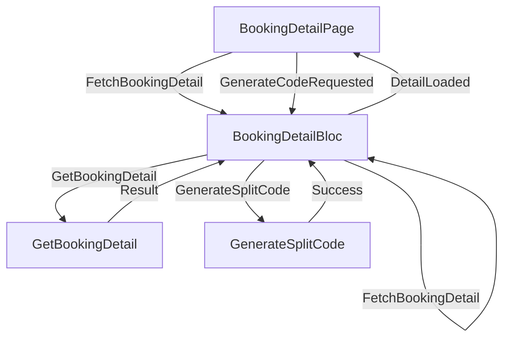

# MODIFICATION DESIGN: Split Bill Feature (UI & Detail Logic)

## Overview
This document outlines the design for the UI and additional backend logic required for the "Split Bill" feature in Gsports.
It covers the `BookingDetailPage`, the `BookingDetailBloc`, and the necessary `GetBookingDetail` use case.

## Goal
To provide users with a dedicated page to view booking details, manage split bill codes, and see the list of participants.
This completes the user-facing part of the Split Bill feature.

## Analysis
- **Missing Backend Logic:** We need a way to fetch a *single* booking by ID to refresh the detail page. Current `GetMyBookings` returns a list.
- **UI Requirements:**
    - Minimalist design (Stitch-inspired).
    - Clear display of the Split Code.
    - List of participants.
    - Ability to generate a code if one doesn't exist.

## Detailed Design

### 1. Backend: `GetBookingDetail` UseCase
Location: `lib/features/booking/domain/usecases/get_booking_detail.dart`
- **Repository Method:** `Future<Either<Failure, Booking>> getBookingDetail(String bookingId);`
- **DataSource Method:** `Future<BookingModel> getBookingDetail(String bookingId);`

### 2. State Management: `BookingDetailBloc`
Location: `lib/features/booking/presentation/bloc/detail/booking_detail_bloc.dart`

**Events:**
- `FetchBookingDetail(String bookingId)`
- `GenerateCodeRequested(String bookingId)`

**States:**
- `DetailInitial`
- `DetailLoading`
- `DetailLoaded(Booking booking)`
- `DetailError(String message)`

### 3. UI: `BookingDetailPage`
Location: `lib/features/booking/presentation/pages/booking_detail_page.dart`

**Layout Structure:**
- **Scaffold:** Standard AppBar ("Detail Booking").
- **Body:** `SingleChildScrollView`.
    - **Header Card (Venue Info):**
        - Venue Name, Court Name, Date, Time.
        - Status Chip (e.g., "Confirmed", "Waiting Payment").
        - Style: `Card(elevation: 0, shape: RoundedRectangleBorder(side: BorderSide(color: Colors.grey[300])))`.
    - **Split Bill Section:**
        - Title: "Split Bill".
        - Content (If `splitCode` is null):
            - Text: "Bagikan tagihan dengan temanmu."
            - Button: `OutlinedButton` -> "Aktifkan Patungan".
        - Content (If `splitCode` exists):
            - Container with grey border displaying the code (Typography: Heading/Bold).
            - Icon Button for Copy to Clipboard.
    - **Participants Section:**
        - Title: "Peserta".
        - `ListView.builder`:
            - `ListTile`:
                - Leading: CircleAvatar (Profile Pic or Initials).
                - Title: Name.
                - Trailing: Status Chip ("Host" - Paid, "Joined" - Pending).

### 4. Navigation
- Update `AppRouter` (`lib/core/routes/app_router.dart` or similar) to include `/booking-detail/:id`.
- Update `BookingHistoryPage` to navigate to this route on tap.

## Mermaid Diagram (Bloc Flow)

## Summary
This phase bridges the backend logic with the user interface, providing the complete experience for managing a booking and inviting friends.