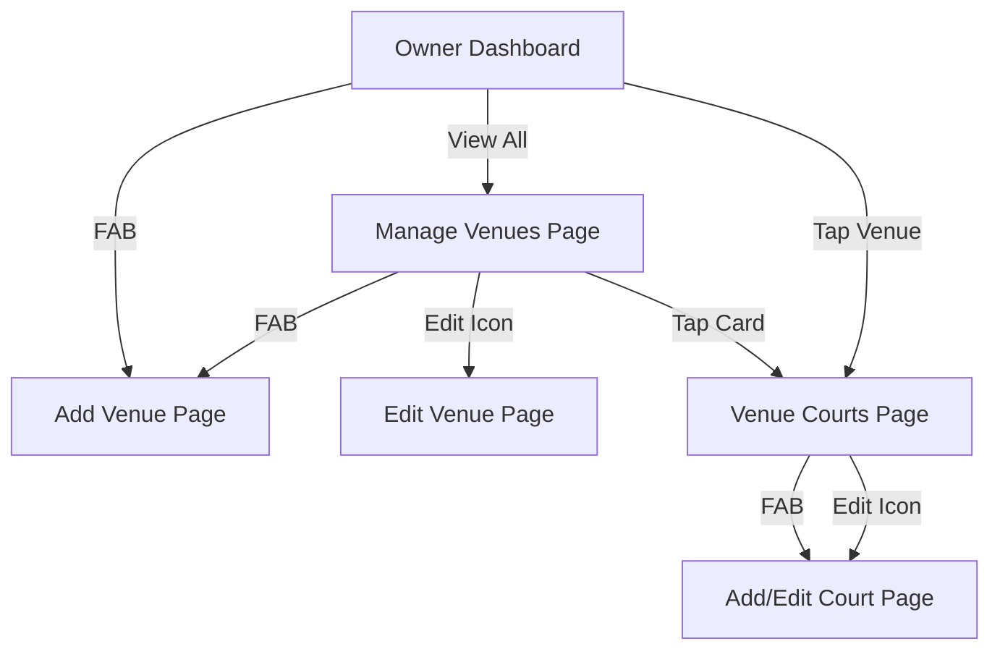

# MODIFICATION DESIGN: Refined Owner Flow & Stability Fix

## Overview
This document outlines the plan to resolve application crashes (ANR) during court management and to refine the user flow for Owner (Partner) users. The primary focus is on stability, correct state management scoping, and logical navigation.

## Detailed Analysis

### 1. The Crash (ANR)
The user reported an immediate force close when navigating to the "Add Court" page. 
**Likely Causes:**
- **Syntactic Error:** `DropdownButtonFormField` was used with `initialValue`, which is not a valid parameter. This causes a build-time exception that, if unhandled during a critical bridge initialization, can lead to hangs.
- **Provider Error:** `CourtManagementBloc` is provided in `VenueCourtsPage`, but not in its sub-route `AddEditCourtPage`. Accessing `context.read<CourtManagementBloc>()` in the child route throws a `ProviderNotFoundException`.
- **WebView Conflict:** The log mentions `AndroidWebkitLibraryPigeonInstanceManager`. This might be a side effect of how errors are handled on the device or a conflict with a background process.

### 2. User Flow Refinement
The current flow needs to be more "Dedicated":
- **Dashboard:** Stats overview + Quick access to recent venues.
- **Venue Management:** List all owned venues.
- **Court Management:** Deep-dive into a specific venue to manage its courts and pricing.

## Proposed Design

### A. Correct State Management (GoRouter Integration)
We will refactor the router to ensure that sub-routes have access to the necessary Blocs. Instead of simple `builder` returns, we will wrap sub-route widgets in `BlocProvider` if they are part of a shared logical flow.

### B. Widget Fixes
- Replace `initialValue` with `value` in all `DropdownButtonFormField` instances.
- Ensure all required parameters are passed to `Court` and `Venue` entities.

### C. Refined Navigation Tree

### D. Detailed Implementation Logic

1.  **Router Update:**
    - Provide `VenueManagementBloc` to `/manage-venues`, `/add-venue`, and `/edit-venue`.
    - Provide `CourtManagementBloc` to `/venue-courts/:venueId` and its sub-routes.
    - This prevents `ProviderNotFoundException`.

2.  **Entity/Model Synchronization:**
    - Ensure `CourtModel.fromFirestore` and `toJson` correctly handle `surfaceType` and `isIndoor`.

3.  **UI Polish:**
    - Use `DropdownSearch` or similar for long lists (like Indonesian Cities) if available, or keep the existing API-based dynamic dropdowns but fix the `value` parameter.

## Alternatives Considered
- **Global Bloc Provision:** Providing all management Blocs at the root of the app. 
    - *Pros:* Simpler.
    - *Cons:* Wasteful of resources for regular users who never see the owner side.
- **Manual Bloc Passing:** Passing the Bloc instance via `extra` in GoRouter.
    - *Pros:* Precise.
    - *Cons:* Breaks if the user deep-links or refreshes the app (for web).

**Chosen Approach:** Route-scoped `BlocProvider` in the `AppRouter` configuration.

## Summary
By fixing the widget syntax and ensuring proper Bloc scoping in the router, we eliminate the primary triggers for crashes and exceptions. The refined flow provides a professional management experience for venue owners.

## Research
- `webview_flutter` Pigeon ANR: GitHub issues suggest disposal and thread communication as common friction points.
- GoRouter Bloc Scope: Standard pattern is to wrap the route widget or use a ShellRoute.
